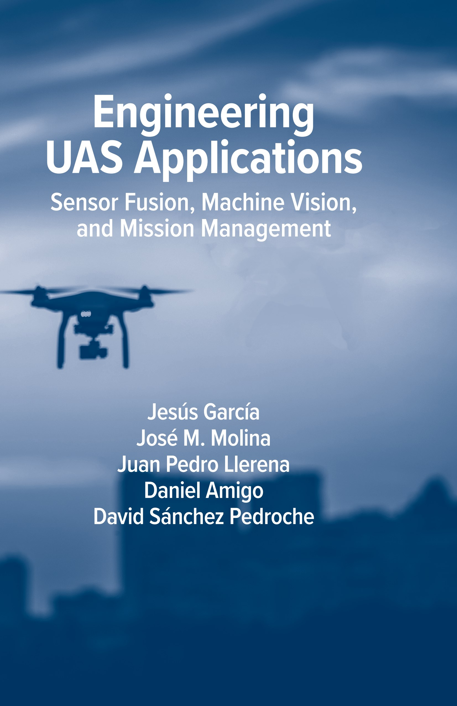

# Engineering UAS Applications Sensor Fusion Machine Vision and Mission Management
This repository contains code for the book Engineering UAS Applications Sensor Fusion Machine Vision and Mission Management by Jesus Garcia, José M. Molina, Daniel Amigo, Juan Pedro Llerena and David Sánchez Pedroche, published by Artech House.

Link to our research group (GIAA) webpage: https://giaa.uc3m.es/giaa_drone_lab/

Link to the book: https://uk.artechhouse.com/Engineering-UAS-Applications-Sensor-Fusion-Machine-Vision-and-Mission-Management-P2216.aspx

# Description
Unmanned aerial systems (UAS) have evolved rapidly in recent years thanks to advances in microelectromechanical components, navigation, perception, and artificial intelligence, allowing for a fast development of autonomy. This book presents general approaches to develop, test, and evaluate critical functions such as navigation, obstacle avoidance and perception, and the capacity to improve performance in real and simulated scenarios. It provides the practical knowledge to install, analyze and evaluate UAS solutions working in real systems; illustrates how to use and configure complete platforms and software tools; and reviews the main enabling technologies applied to develop UAS, possibilities and evaluation methodology. You will get the tools you need to evaluate navigation and obstacle avoidance functions, object detection, and planning and landing alternatives in simulated conditions. The book also provides helpful guidance on the integration of additional sensors (video, weather, meteorological) and communication networks to build IoT solutions. This is an important book for practitioners and researchers interested in integrating advanced techniques in the fields of AI, sensor fusion and mission management, and anyone interest in applying and testing advanced algorithms in UAS platforms.

# Who should read this book
This book is directed to researchers, practitioners and students interested in getting a general knowledge of techniques used in development of unmanned aerial systems and how to experiment with available standard hardware and software tools with examples in real or simulated scenarios. Unmanned aerial systems (UAS) are based on recent advancements in different areas such as navigation, perception, information fusion and artificial intelligence, allowing autonomous operations and diverse applications in defense and civil areas. Therefore, the development of such systemic capabilities requires research in these areas in evolution, and development of analysis procedures including novel simulation capabilities for the study of complex scenarios of operation. This book presents general approaches to design, test and evaluate critical functions of UAS such as navigation, obstacle avoidance and perception, integrated in autonomous systems, and the capacity to improve their performance in real and simulated scenarios.

# About the authors
### Jesus García
is full professor at the Universidad Carlos III de Madrid. He joined the Computer Science Department of that university in 1999. His main research interests are computational intelligence, sensor and information fusion, machine vision, traffic management systems and autonomous vehicles. Within these areas, including theoretical and applied aspects, he has co-authored more than 10 book chapters, 70 journal papers and 200 conference papers. He has served on several advisory and programming committees in organizations IEEE, ISIF and NATO. He has been chair of the Spanish IEEE Chapter on Aerospace and Electronic Systems (2013-2018) appointed Spanish member of several NATO-STO Research Groups (2011-2021).

### José M. Molina
is full professor at the Universidad Carlos III de Madrid. He joined the Computer Science Department of the Universidad Carlos III de Madrid in 1993. He received a degree in Telecommunications Engineering in 1993 and a PhD degree in 1997 both from the Universidad Politécnica de Madrid. Currently he coordinates the Applied Artificial Intelligence Group (GIAA). His current research focuses on the application of soft computing techniques (NN, Evolutionary Computation, Fuzzy Logic and Multiagent Systems) to radar data processing, air traffic management, e-commerce and ambient intelligence. He has authored up to 100 journal papers and 200 conference papers.

### Daniel Amigo
is a PhD student at the University Carlos III of Madrid. In 2019 he completed a double Master's degree in Computer Engineering and Computer Science and Technology and a bachelor’s degree in Computer Engineering in 2017, both from the same university. He is involved in research projects on vehicle tracking and surveillance. His research interests lie in the field of air traffic control, data fusion, autonomous vehicles applications, remote sensing, machine learning, digital twins and UAS simulations.

### Juan Pedro Llerena
has a degree in Physics from Complutense University of Madrid (UCM) specialized in physical devices and control. He did an inter-university master's degree between the National Distance Education University (UNED) and UCM specializing in systems engineering and control, motivating his interest in data fusion systems, artificial intelligence, computer vision, and UAVs. Currently, Juan Pedro is a Ph.D. student and researcher in the Applied Artificial Intelligence Group (GIAA) at the Carlos III University of Madrid where his work focuses on the study of drone support technologies.

### David Sánchez Pedroche
has a pre-doctoral contract at the Universidad Carlos III de Madrid. He graduated in Computer Engineering in 2017 with a double Master’s degree in Computer Engineering and Computer Science and Technology in 2019, both from Universidad Carlos III de Madrid. He joined the Department of Computer Science at Universidad Carlos III de Madrid as part of the Applied Artificial Intelligence Group (GIAA) in 2018. His work in the GIAA involves research projects on trajectory reconstruction and vehicle tracking and surveillance. His current research focuses on the application of machine learning techniques over trajectory data, radar data processing and detection systems, air and maritime traffic management, air traffic control and UAS intelligence.